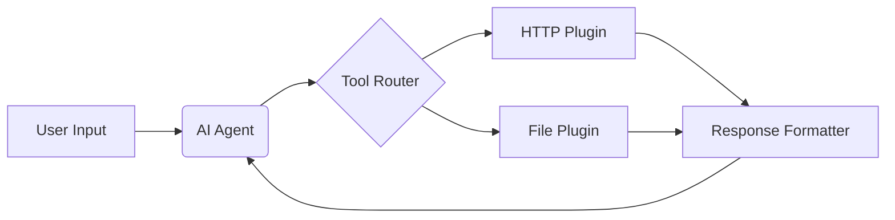

# AI Features

Undergrowth includes powerful AI capabilities through local LLM inference, enabling intelligent automation workflows without cloud dependencies.

## Overview

The AI system is built on **Ollama**, a lightweight LLM runtime that runs models locally on your machine. This provides:

- 🔒 **Privacy** — Your data never leaves your machine
- ⚡ **Low Latency** — No network round-trips
- 💰 **Cost-Free** — No API fees or usage limits
- 🔌 **Offline** — Works without internet

## AI Plugins

| Plugin | Description |
|--------|-------------|
| `ai:ai_agent` | Autonomous agent with tool-calling capabilities |
| `ai:generate_workflow` | Generate workflows from natural language |
| `memory:embed` | Create text embeddings for semantic search |
| `memory:store` | Store vectors in local database |
| `memory:search` | Semantic similarity search |

## Getting Started

1. **[Set up Ollama](./ollama-setup)** — Install the LLM runtime
2. **Create an AI workflow** — Wire up AI plugins in the WebUI
3. **Pull a model** — Download a model like `llama3.2` or `phi3`

## Architecture

AI features leverage existing Engine capabilities:

- **Agents** = Workflows with feedback loops
- **Tools** = Standard plugins (HTTP, File, etc.)
- **Brain** = AI inference component
- **Memory** = Vector storage for context

