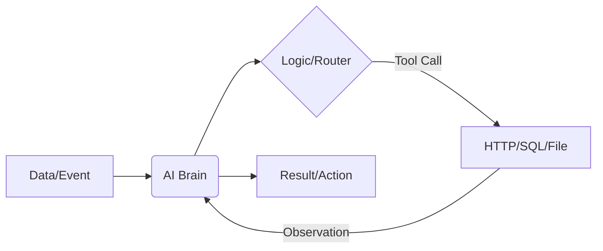

# System Concepts & Mappings

> **Purpose**: This document defines the core terminology and hierarchical relationships within Undergrowth, ensuring technical clarity for developers and architectural consistency across the engine.

## 🏛️ Core Hierarchy

The Engine is built on a strict containment hierarchy that separates binary distribution from runtime instantiation.

### 1. The Runtime Layer
*   **Engine Host** (`undergrowth.exe`): The primary orchestrator. Handles message passing, plugin lifecycle, scheduling, and license enforcement.
*   **Plugin Library** (`.dll` / `.so`): A binary container built against the **Undergrowth Foundation**. It acts as a set of capabilities.
    *   *Analogy*: A shared library or "Package".

### 2. The Type Layer
*   **Variation** (Type Definition): A specific functional "role" provided by a plugin. 
    *   *Example*: `ai:ai_chat`, `http:http_request`.
    *   *Role*: Defines the execution logic (Handler), configuration schema (via `schemars`), and metadata (Icons, Categories).
    *   *Analogy*: A **Class**.

### 3. The Instance Layer
*   **Component** (Node): A user-configured instance of a Variation.
    *   *Example*: An `http_request` variation named "Sync Inventory" with a specific URL and headers.
    *   *Analogy*: An **Object Instance**.

### 4. The Orchestration Layer
*   **Workflow** (Graph): A static, persisted definition of connected Components.
    *   *Role*: The blueprint for data flow. Edges define how output from Component A is piped into the input of Component B.
*   **Job** (Execution): A **stateful process** running a Workflow.
    *   *Role*: Holds the runtime context, handles backpressure, and manages parallel execution of components.
    *   *Analogy*: A **Process** running compiled code.

---

## 🧠 AI Strategy: Managed vs. Embedded

Undergrowth provides a dual-path approach to AI to balance flexibility with ease of deployment.

| Concept | **Managed External** (AI Plugin) | **Embedded Native** (Cortex Plugin) |
|:---|:---|:---|
| **Mechanism** | Connects to external services via API. | Loads model weights directly into process memory. |
| **Provider** | Ollama, OpenAI, Anthropic, Gemini. | Native GGUF inference (llama.cpp bindings). |
| **Use Case** | High-performance, multi-model flexibility. | Air-gapped, zero-dependency local automation. |
| **Setup** | Requires "Managed Dependencies" setup. | self-contained; just needs a `.gguf` file. |

---

## 🛡️ Security & Data Gravity

Undergrowth enforces security at two primary boundaries:

### 1. The Control Plane (RBAC)
User access to the Engine is governed by **Role-Based Access Control** integrated with **OIDC (Keycloak)**.
*   **Admin**: Full system control (Plugins, Licenses, Setup).
*   **Operator**: Manage workflows and jobs.
*   **Viewer**: Read-only monitoring.

### 2. The Data Plane (Sandboxing)
Plugins operate within a **PluginContext** which enforces "Data Gravity":
*   **Isolated Storage**: Every component is provided a `data_dir` isolated to its run-context. Path traversal (`..`) is strictly blocked at the Foundation level.
*   **Capability Gating**: Plugins must use Foundation interfaces for disk/network access, allowing the engine to audit or intercept I/O.

---

## 📜 Licensing & Tiers

Undergrowth uses a **Hybrid License Format** (JSON Header + Encrypted Payload + Ed25519 Signature).

| Tier | Limits | Key Features |
|:---|:---|:---|
| **Community** | 3 Workflows / 3 Jobs | Free, basic automation, 100 AI calls/day. |
| **Starter** | 10 Workflows / 10 Jobs | Licensed, 500 AI calls/day, Extended History. |
| **Pro / Team**| **Unlimited** | Commercial use, SSO/OIDC, Audit Logs, Priority Support. |

---

## 🔄 The "Agentic" Loop

In Undergrowth, an **AI Agent** is not a special entity, but a specific pattern of the Core Hierarchy:
1.  **Job** provides the runtime lifecycle.
2.  **AI Component** acts as the "Brain".
3.  **Connectors** form the feedback loop.
4.  **Tools** are simply other standard Components (HTTP, SQL, File) called by the Brain via a router.

